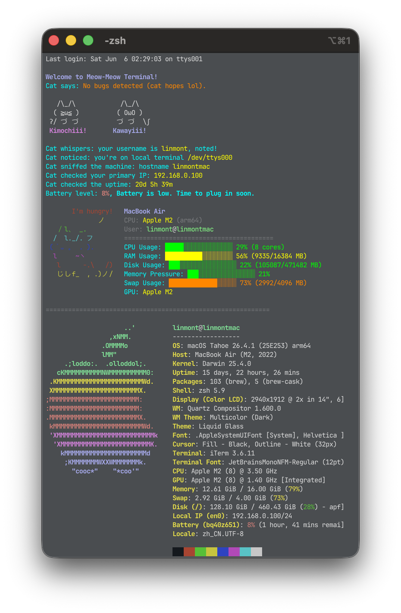

# Meow-Meow_Terminal_zsh_plugin
✨ 可爱，简洁，强大的minifetch+终端文本方案

让你的终端更加可爱酷炫

## 美化效果展示



（其他展示效果请前往GitHub Workflows查看各个系统的工作状态）

## 使用方法

目前所有脚本支持大部分主流 Linux (特殊BusyBox或者Alpine Linux可能出现兼容问题) Mac OS 系列和 Microsoft Windows Powershell7以上的操作系统

使用其他非主流系统安装上去这个可能会出现兼容性问题

将仓库内对应系统的脚本文件下载复制

Linux或者MacOS系统，请确保你的系统安装了 `zsh` 并且设置为默认终端，这样即可获得更加完整的体验

对于Windows系统，请确保你安装了 `Chocolatey` 来安装其他必要的软件，比如 `FastFetch`

无论是任何系统，使用本项目前最好都要安装 fastfetch 来兼容相关参数工作，当然，这是非必须的

粘贴仓库内的对应系统的脚本文件内容，放入用户目录下的 `.zshrc` 文件，重启终端即可安装完成

### Oh My Zsh 用户安装方法

如果你已经安装了 Oh My Zsh，你可以按照以下步骤作为自定义插件安装：

1. 创建插件目录：
   ```bash
   mkdir -p "${ZSH_CUSTOM:-$ZSH/custom}"/plugins/meow-meow
   ```
2. 下载脚本到该插件目录：
   ```bash
   curl -L https://raw.githubusercontent.com/linmontfurry/Meow-Meow_Terminal_zsh_plugin/refs/heads/main/zshrc.sh -o "${ZSH_CUSTOM:-$ZSH/custom}"/plugins/meow-meow/meow-meow.plugin.zsh
   ```
3. 修改 `~/.zshrc`，在 `plugins` 列表中加上 `meow-meow`：
   ```bash
   plugins=(
       # ... 其他插件
       meow-meow
   )
   ```

4. 保存并重启终端, 或者:
   ```bash
   omz reload # or source ~/.zshrc
   ```

*参考资料：[Oh My Zsh Customization - Overriding and adding plugins](https://github.com/ohmyzsh/ohmyzsh/wiki/Customization#overriding-and-adding-plugins)*

#### 关闭部分系统的开机文本

由于部分系统可能存在自带的开机文本显示，与本项目使用可能会出现显示杂乱的问题

你可以参考下面的相关命令关闭系统自带的开机文本

**Ubuntu / Debian / Linux Mint**
```sh
# 关闭动态 MOTD
[ -d /etc/update-motd.d ] && sudo find /etc/update-motd.d -type f -exec chmod -x {} +

# 关闭 Ubuntu motd-news
[ -f /etc/default/motd-news ] && sudo sed -i 's/^ENABLED=.*/ENABLED=0/' /etc/default/motd-news

# 清空静态登录文本
sudo sh -c ': > /etc/motd'
sudo sh -c ': > /etc/issue'
sudo sh -c ': > /etc/issue.net'

# 当前用户静音 Last login / mail / 部分 MOTD
touch ~/.hushlogin

# SSH 登录不打印系统 MOTD 和 Last login
sudo sh -c 'grep -q "^PrintMotd" /etc/ssh/sshd_config && sed -i "s/^PrintMotd.*/PrintMotd no/" /etc/ssh/sshd_config || echo "PrintMotd no" >> /etc/ssh/sshd_config'
sudo sh -c 'grep -q "^PrintLastLog" /etc/ssh/sshd_config && sed -i "s/^PrintLastLog.*/PrintLastLog no/" /etc/ssh/sshd_config || echo "PrintLastLog no" >> /etc/ssh/sshd_config'

sudo systemctl reload ssh 2>/dev/null || sudo systemctl reload sshd 2>/dev/null
```

**RHEL / CentOS / Rocky / Alma / Fedora / Arch / Manjaro / Alpine 通用**
```sh
sudo sh -c ': > /etc/motd'
sudo sh -c ': > /etc/issue'
sudo sh -c ': > /etc/issue.net'

touch ~/.hushlogin

sudo sh -c 'grep -q "^PrintMotd" /etc/ssh/sshd_config && sed -i "s/^PrintMotd.*/PrintMotd no/" /etc/ssh/sshd_config || echo "PrintMotd no" >> /etc/ssh/sshd_config'
sudo sh -c 'grep -q "^PrintLastLog" /etc/ssh/sshd_config && sed -i "s/^PrintLastLog.*/PrintLastLog no/" /etc/ssh/sshd_config || echo "PrintLastLog no" >> /etc/ssh/sshd_config'

sudo systemctl reload sshd 2>/dev/null || sudo rc-service sshd reload 2>/dev/null || sudo service sshd reload 2>/dev/null
```

Ubuntu、Debian、Linux Mint、Pop!_OS 等 Debian 系更适合使用第一套

大多数非 Debian 系 Linux，包括 RHEL 系、Fedora、Arch、Manjaro、Alpine 使用第二套是更好的选择

当然，若你不太介意于显示效果。关闭系统自带开机文本的选项是非必须的。

### Windows 用户安装方法
1. 安装Powershell7

安装教程：https://learn.microsoft.com/zh-cn/powershell/scripting/install/install-powershell-on-windows?view=powershell-7.5

2. 打开powershell7并安装fastfetch
 ``` winget install fastfetch 
 ```

3. 下载本项目并解压
Code-Download ZIP

4. 将powershell7切换到解压目录并运行
 ``` cd [解压目录]
.\index2.ps1
 ```

## TODO list

- 让最小化实现的 minifetch 更强大
- 准备更多猫咪类型的 ASCII 图标
- ......

# 开源协议

本仓库使用 MIT 开源，其他内容不再概述

如果有相关建议请发表 issues 提供建议
