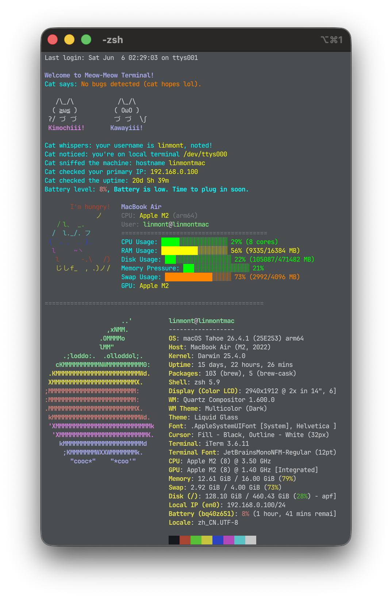

# Meow-Meow_Terminal_zsh_plugin
✨ 可爱，简洁，强大的minifetch+终端文本方案

让你的终端更加可爱酷炫

## 美化效果展示



（其他展示效果请前往GitHub Workflows查看各个系统的工作状态）

## 使用方法

目前所有脚本支持大部分主流 Linux (特殊BusyBox或者Alpine Linux可能出现兼容问题) Mac OS 系列和 Microsoft Windows Powershell7以上的操作系统

使用其他非主流系统安装上去这个可能会出现兼容性问题

将仓库内对应系统的脚本文件下载复制

Linux或者MacOS系统，请确保你的系统安装了 `zsh` 并且设置为默认终端，这样即可获得更加完整的体验

对于Windows系统，请确保你安装了 `Chocolatey` 来安装其他必要的软件，比如 `FastFetch`

无论是任何系统，使用本项目前最好都要安装 fastfetch 来兼容相关参数工作，当然，这是非必须的

粘贴仓库内的对应系统的脚本文件内容，放入用户目录下的 `.zshrc` 文件，重启终端即可安装完成

### Oh My Zsh 用户安装方法

**推荐：把仓库直接 clone 到插件目录。** 插件会自动识别 Linux 或 macOS，之后更新也只要 `git pull`。

1. clone 到自定义插件目录：
   ```bash
   git clone https://github.com/linmontfurry/Meow-Meow_Terminal_zsh_plugin.git "${ZSH_CUSTOM:-$HOME/.oh-my-zsh/custom}"/plugins/meow-meow
   ```
2. 修改 `~/.zshrc`，在 `plugins` 列表中加上 `meow-meow`：
   ```bash
   plugins=(
       # ... 其他插件
       meow-meow
   )
   ```
3. 保存并重启终端, 或者:
   ```bash
   omz reload # or source ~/.zshrc
   ```

以后更新：

```bash
git -C "${ZSH_CUSTOM:-$HOME/.oh-my-zsh/custom}"/plugins/meow-meow pull
```

<details>
<summary>也可以只下载单个脚本</summary>

1. 创建插件目录：
   ```bash
   mkdir -p "${ZSH_CUSTOM:-$ZSH/custom}"/plugins/meow-meow
   ```
2. 下载对应系统的脚本到该插件目录：

   Linux：
   ```bash
   curl -L https://raw.githubusercontent.com/linmontfurry/Meow-Meow_Terminal_zsh_plugin/refs/heads/main/zshrclinux.sh -o "${ZSH_CUSTOM:-$ZSH/custom}"/plugins/meow-meow/meow-meow.plugin.zsh
   ```

   macOS：
   ```bash
   curl -L https://raw.githubusercontent.com/linmontfurry/Meow-Meow_Terminal_zsh_plugin/refs/heads/main/zshrcmac.sh -o "${ZSH_CUSTOM:-$ZSH/custom}"/plugins/meow-meow/meow-meow.plugin.zsh
   ```
3. 之后同上，在 `plugins` 里加上 `meow-meow`。

</details>

用其他插件管理器（zinit、antidote、antigen、zplug 等）时，它们按惯例会加载仓库根目录的 `meow-meow.plugin.zsh`，这个文件就是插件入口。

**Powerlevel10k 用户：** 如果开启了 instant prompt，p10k 检测到 zsh 初始化期间有输出时会显示一段警告。banner 本来就是在初始化时打印的，所以按 p10k 官方文档的建议，在 `~/.p10k.zsh` 里把 `POWERLEVEL9K_INSTANT_PROMPT` 改成 `quiet` 即可。这只会关掉警告，banner 照常显示。

插件不会改动你的 shell 环境：你设置的 zsh 选项、同名的变量和函数都会原样保留。

*参考资料：[Oh My Zsh Customization - Overriding and adding plugins](https://github.com/ohmyzsh/ohmyzsh/wiki/Customization#overriding-and-adding-plugins)*

#### 关闭部分系统的开机文本

由于部分系统可能存在自带的开机文本显示，与本项目使用可能会出现显示杂乱的问题

你可以参考下面的相关命令关闭系统自带的开机文本

**Ubuntu / Debian / Linux Mint**
```sh
# 关闭动态 MOTD
[ -d /etc/update-motd.d ] && sudo find /etc/update-motd.d -type f -exec chmod -x {} +

# 关闭 Ubuntu motd-news
[ -f /etc/default/motd-news ] && sudo sed -i 's/^ENABLED=.*/ENABLED=0/' /etc/default/motd-news

# 清空静态登录文本
sudo sh -c ': > /etc/motd'
sudo sh -c ': > /etc/issue'
sudo sh -c ': > /etc/issue.net'

# 当前用户静音 Last login / mail / 部分 MOTD
touch ~/.hushlogin

# SSH 登录不打印系统 MOTD 和 Last login
sudo sh -c 'grep -q "^PrintMotd" /etc/ssh/sshd_config && sed -i "s/^PrintMotd.*/PrintMotd no/" /etc/ssh/sshd_config || echo "PrintMotd no" >> /etc/ssh/sshd_config'
sudo sh -c 'grep -q "^PrintLastLog" /etc/ssh/sshd_config && sed -i "s/^PrintLastLog.*/PrintLastLog no/" /etc/ssh/sshd_config || echo "PrintLastLog no" >> /etc/ssh/sshd_config'

sudo systemctl reload ssh 2>/dev/null || sudo systemctl reload sshd 2>/dev/null
```

**RHEL / CentOS / Rocky / Alma / Fedora / Arch / Manjaro / Alpine 通用**
```sh
sudo sh -c ': > /etc/motd'
sudo sh -c ': > /etc/issue'
sudo sh -c ': > /etc/issue.net'

touch ~/.hushlogin

sudo sh -c 'grep -q "^PrintMotd" /etc/ssh/sshd_config && sed -i "s/^PrintMotd.*/PrintMotd no/" /etc/ssh/sshd_config || echo "PrintMotd no" >> /etc/ssh/sshd_config'
sudo sh -c 'grep -q "^PrintLastLog" /etc/ssh/sshd_config && sed -i "s/^PrintLastLog.*/PrintLastLog no/" /etc/ssh/sshd_config || echo "PrintLastLog no" >> /etc/ssh/sshd_config'

sudo systemctl reload sshd 2>/dev/null || sudo rc-service sshd reload 2>/dev/null || sudo service sshd reload 2>/dev/null
```

Ubuntu、Debian、Linux Mint、Pop!_OS 等 Debian 系更适合使用第一套

大多数非 Debian 系 Linux，包括 RHEL 系、Fedora、Arch、Manjaro、Alpine 使用第二套是更好的选择

当然，若你不太介意于显示效果。关闭系统自带开机文本的选项是非必须的。

### Windows 用户安装方法
1. 安装Powershell7

安装教程：https://learn.microsoft.com/zh-cn/powershell/scripting/install/install-powershell-on-windows?view=powershell-7.5

2. 打开powershell7并安装fastfetch
 ``` winget install fastfetch 
 ```

3. 下载本项目并解压
Code-Download ZIP

4. 将powershell7切换到解压目录并运行
 ``` cd [解压目录]
.\meow.ps1
 ```

如果希望每次打开终端都自动显示，把上面那行加入你的 PowerShell 配置文件（`$PROFILE`）即可

## 缓存与调优

脚本会把**不会变的硬件信息**（机型、CPU 型号、GPU 名称、核心数）和**少数很慢的采样**缓存下来，避免每开一次终端都重新探测一遍。

缓存只有**一个固定文件**，每次原地覆写。开一万次终端也只有这一个文件，不会堆积：

| 系统 | 位置 |
| --- | --- |
| Linux / macOS | `${XDG_CACHE_HOME:-~/.cache}/meow-terminal/facts`，都没有时退回 `${TMPDIR:-/tmp}/meow-terminal-<uid>/facts` |
| Windows | `%LOCALAPPDATA%\meow-terminal\facts` |

选 `~/.cache` 而不是 `/tmp`，是因为 `/tmp` 重启就被清空（部分系统还是 tmpfs，占内存），缓存每次开机都会失效。文件本身只有一百多字节，放哪都无所谓，没有 `HOME` 时会自动退回 `/tmp`。

两个环境变量可以调：

```sh
export MEOW_STATIC_TTL=604800   # 硬件信息缓存多久（秒），默认 7 天
export MEOW_SAMPLE_TTL=10       # 昂贵采样缓存多久（秒），默认 10 秒
```

`MEOW_SAMPLE_TTL` 管的是 CPU 占用率这类必须实时取、但取一次很慢的数据（macOS 的 `top`、Windows 的 GPU 计数器）。连开好几个标签页时它让后面几个几乎瞬间出来；调大更快，但显示的数字会更旧。想每次都重新探测就设成 `0`。

探测失败不会写进缓存，所以偶尔一次失败不会让 `Unknown CPU` 之类的结果被锁上很久。

删掉缓存文件随时可以，下次开终端会自动重建。

## TODO list

- 让最小化实现的 minifetch 更强大
- 准备更多猫咪类型的 ASCII 图标
- ......

# 开源协议

本仓库使用 MIT 开源，其他内容不再概述

如果有相关建议请发表 issues 提供建议
